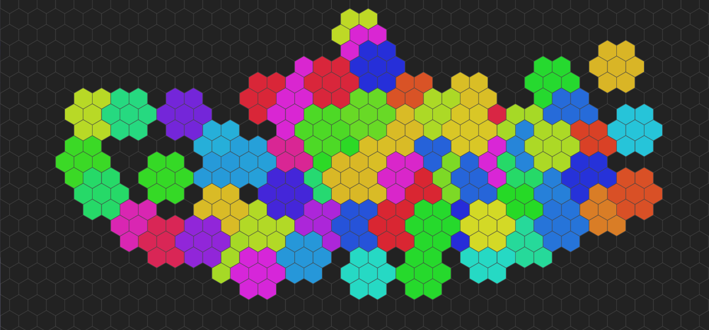

# EightPaint



EightPaint is a tiny hex-grid painting toy written in plain HTML and JavaScript.

Click anywhere on the grid and it colors that hex and its neighbors using the active palette.  
The canvas is infinite, the view can be panned around, and your drawing state is saved locally and encoded in the URL so it can be shared.

No framework.  
No build system.  
No dependencies.  
Just a canvas and some hex math.

---

## Controls

### 🎨 Painting

| Action | Result |
|------|------|
| 🖱 **Left Click / Drag** | Paint hex + neighbors |
| 🖱 **Right Click** | Erase hex + neighbors |

### 🧭 Navigation

| Action | Result |
|------|------|
| 🖱 **Middle Click + Drag** | Pan the grid |
| ⌨ **Shift + Drag** | Pan the grid |
| ⌨ **Hold Space** | Temporary zoom-out view |

### 🌈 Palettes

| Action | Result |
|------|------|
| 🖱 **Mouse Wheel** | Cycle color palettes |

Includes palettes like:

🌿 Swamp • 🔥 Lava • ❄ Ice • 🎨 Pastel • ⚫⚪ Mono • 🌈 Rainbow • 🍬 Candy • 🌲 Forest • 🌊 Ocean

---

## Features

- 🧩 Infinite hex grid
- 🎨 Neighbor-based hex painting
- 💾 Local persistence
- 🔗 Shareable drawings via encoded URL state
- 🖥 Responsive canvas resizing

---

## Run

Clone the repo and open the HTML file.

```bash
git clone https://github.com/yourusername/eightpaint
cd eightpaint
open index.html
