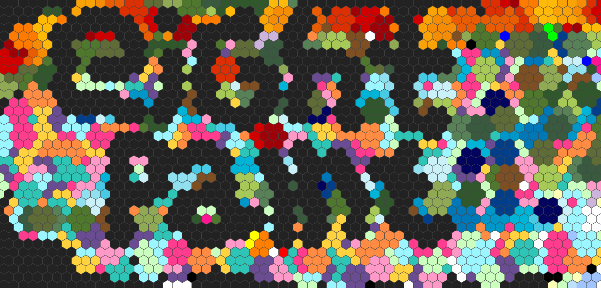

# 🎨 EightPaint 

Click on screenshot below to play!
[](https://luckymonkey.github.io/eightpaint/index.html)

EightPaint is a tiny hex-grid painting toy written in plain HTML and JavaScript.

Click anywhere on the grid and it colors that hex and its neighbors using the active palette.  
The canvas is infinite, the view can be panned around, and your drawing state is saved locally and encoded in the URL so it can be shared.

No framework.  
No build system.  
No dependencies.  
Just a canvas and some hex math.

---

## Live preview (GitHub Pages)

1. Push this repo to GitHub.
2. In your repository, open **Settings -> Pages** and set **Source = GitHub Actions**.
3. After the deploy workflow runs, click the screenshot to open and play the live app.

---

## Controls

### 🎨 Painting

| Action | Result |
|------|------|
| 🖱 **Left Click / Drag** | Paint hex + neighbors |
| 🖱 **Right Click** | Erase hex + neighbors |

### 🧭 Navigation

| Action | Result |
|------|------|
| 🖱 **Middle Click + Drag** | Pan the grid |
| ⌨ **Shift + Drag** | Pan the grid |
| ⌨ **Hold Space** | Zoomed-out black/white overview + grab hand cursor |

### 🌈 Palettes

| Action | Result |
|------|------|
| 🖱 **Mouse Wheel** | Cycle color palettes + blink palette label at cursor |

Includes palettes like:

🌿 Swamp • 🔥 Lava • ❄ Ice • 🎨 Pastel • ⚫⚪ Mono • 🌈 Rainbow • 🍬 Candy • 🌲 Forest • 🌊 Ocean

---

## Features

- 🧩 Infinite hex grid
- 🎨 Neighbor-based hex painting
- ⚫⚪ Spacebar zoomed-out monochrome preview
- ✨ Cursor-following palette indicator with blink/fade behavior
- 🖐 Hand/grab cursor during space-view and panning
- 🚀 Faster, smoother panning interpolation
- 💾 Local persistence
- 🔗 Shareable drawings via encoded URL state
- 🖥 Responsive canvas resizing
- 🌍 GitHub Pages deploy workflow

---

## Run locally

```bash
git clone https://github.com/yourusername/eightpaint
cd eightpaint
python3 -m http.server 4173
# open http://localhost:4173
```
